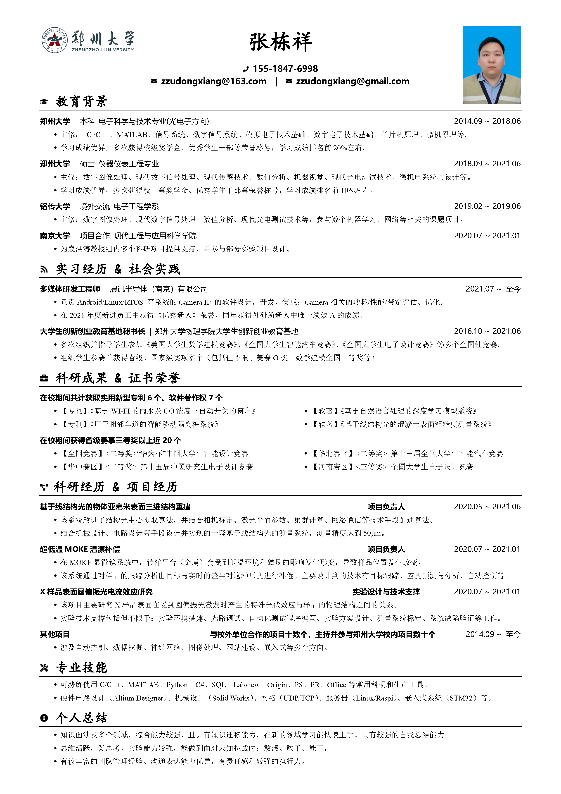

# 张栋祥

**TEL:** 15518476998  |  **Email:** zzudongxiang@163.com

### I. 最新简历

**高清版本跳转：** [张栋祥.pdf](resume/220409/张栋祥.pdf)

### II. 证明材料

#### 1. [比赛获奖](material/1.%20比赛获奖)

#### 2. [专利软著](material/2.%20专利软著)

#### 3. [经历证明](material/3.%20经历证明)

#### 4. [其他](material/4.%20其他)

---

